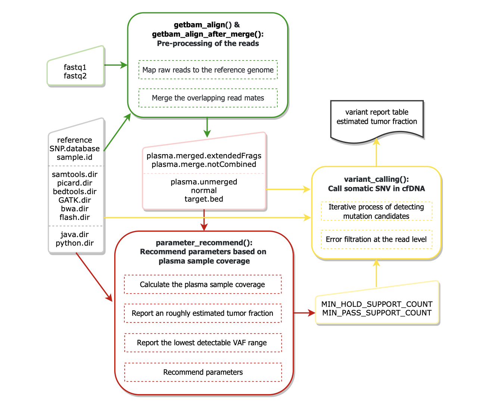

<!-- README.md is generated from README.Rmd. Please edit that file -->

# cfSNV

<!-- badges: start -->

[](https://github.com/ben-laufer/DMRichR/actions)
[](https://lifecycle.r-lib.org/articles/stages.html#maturing)

**Website:**
[jasminezhoulab/cfSNV/](https://github.com/jasminezhoulab/cfSNV)
<!-- badges: end -->

## Overview

`cfSNV` is an ultra-sensitive and accurate somatic SNV caller designed
for cfDNA sequencing.

More specifically, `cfSNV` provides a bioinformatics pipeline:

  - `getbam_align()` maps raw reads from fastq (gzip or not) files to
    the reference genome.
  - `getbam_align_after_merge()` first merges the overlapping read mates
    in cfDNA sequencing data and then maps raw reads from fastq (gzip or
    not) files to the reference genome.
  - `parameter_recommend()` recommends parameters based on plasma sample
    coverage.
  - `variant_calling()` calls somatic SNV in cfDNA and reports estimated
    tumor fraction.

You can learn more about them in
`vignette("cfSNV")`.



## Installation

After downloading the `cfSNV_0.99.0.tar.gz` file to `yourPath`, you can
install `cfSNV` using the following
code:

``` r
install.packages("yourPath/cfSNV_0.99.0.tar.gz", repos = NULL, type = "source")
```

#### Dependencies

  - samtools 1.11:
    <https://sourceforge.net/projects/samtools/files/samtools/>
  - picard 2.18.4:
    <https://github.com/broadinstitute/picard/releases/tag/2.18.4>
  - bedtools 2.30.0:
    <https://github.com/arq5x/bedtools2/releases/tag/v2.30.0>
  - GATK 3.8.0: <https://github.com/broadgsa/gatk/releases/tag/3.8>
  - bwa 0.7.17: <http://bio-bwa.sourceforge.net/>
  - FLASH2: <https://github.com/dstreett/FLASH2>
  - java 1.8.0\_281 (just need to be compatible with GATK and picard
    tools)
  - python 3.7.0+
      - numpy 1.13.3
      - pandas 0.20.3
      - scipy 1.1.0
      - sklearn 0.24.1 (if using other versions, there will be a
        warining, but may not cause an error)
  - R
4.0+
      - Rcpp
      - reticulate
      - utils

<!-- And the development version from [GitHub](https://github.com/) with: -->

<!-- ``` r -->

<!-- # install.packages("devtools") -->

<!-- devtools::install_github("syslabliu/cfSNV") -->

<!-- ``` -->

## Example

``` r
library(cfSNV)

parameter_recommend(
  plasma.unmerged, normal,
  plasma.merged.extendedFrags, plasma.merge.notCombined,
  target.bed, reference, SNP.database, samtools.dir, sample.id, roughly_estimated_tf = TRUE
)
#> The per base coverage of the plasma sample for each genomic region in the target bed file:
#> average = 105.222, median = 92.9562, 95th percentile = 227.395 
#> 
#> The roughly estimated tumor fraction in the plasma sample: 31.0295% 
#> For a more accurate estimation, please run variant_calling(). 
#> 
#> Lowest detectable VAF range under the default parameters: [2.199%, 5.277%] 
#> 
#> To detect different levels of lowest VAF, 
#> at 1% VAF: MIN_HOLD_SUPPORT_COUNT = 8, MIN_PASS_SUPPORT_COUNT = 2; 
#> at 5% VAF: MIN_HOLD_SUPPORT_COUNT = 17, MIN_PASS_SUPPORT_COUNT = 11 
#> Note: decreasing the parameters (i.e. MIN_HOLD_SUPPORT_COUNT and MIN_PASS_SUPPORT_COUNT) 
#> can lower the detection limit, but may also lower the variant quality.

results <- variant_calling(
  plasma.unmerged, normal, plasma.merged.extendedFrags, plasma.merge.notCombined,
  target.bed, reference, SNP.database, samtools.dir, picard.dir, bedtools.dir,
  sample.id, MIN_HOLD_SUPPORT_COUNT, MIN_PASS_SUPPORT_COUNT
)

results$variant.list
#>   CHROM POSITION ID REF ALT         QUAL FILTER       VAF
#> 1 chr22 20640684  .   A   G 2.918513e+08   PASS 0.3333333
#> 2 chr22 20640690  .   G   A 7.519190e+01   PASS 0.4666667
#> 3 chr22 20640765  .   C   G 1.000000e+00   PASS 0.0800000
#> 4 chr22 29075530  .   T   A 2.409049e+08   PASS 0.5882353
#> 5 chr22 29445285  .   G   A 3.205572e+28   PASS 0.2037037
#> 6 chr22 44342205  .   T   A 1.484423e+77   PASS 0.4285714
#> 7 chr22 44965238  .   G   A 3.889089e+23   PASS 0.1702128
#> 8 chr22 45601484  .   G   C 4.112031e+33   PASS 0.6666667
#> 9 chr22 45723968  .   C   T 1.198760e+11   PASS 0.6400000

results$tumor.fraction
#> [1] "31.6137566137%"
```
